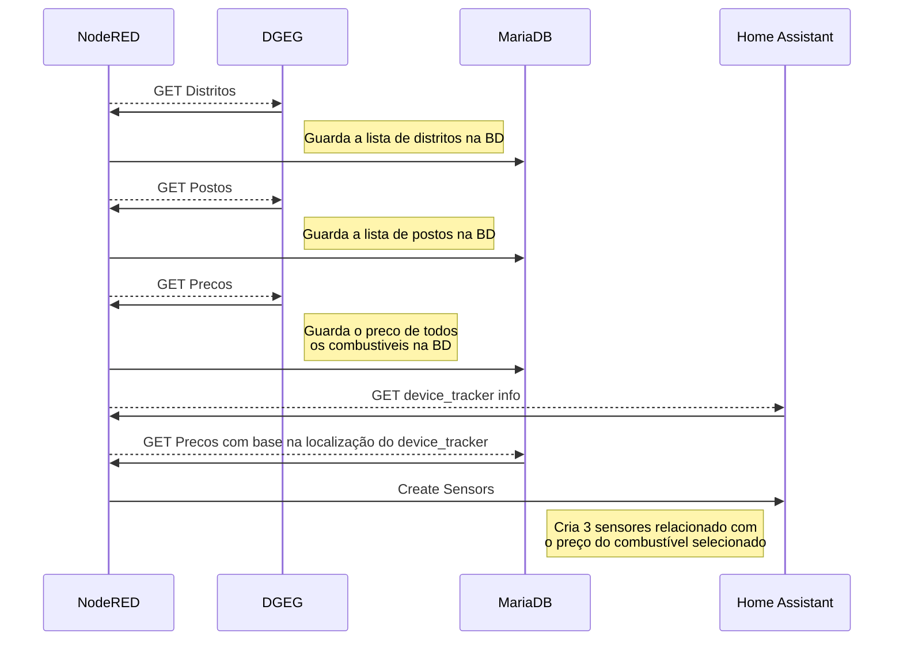

# HA-DGEG-Combustiveis
Node-RED flow que importa o preço dos combustiveis do site da DGEG para base de dados MariaDB, permitindo depois obter os preços mais baratos com base em coordenadas GPS, criando vários sensores no Home Assistant

## Como funciona?


## Requisitios:
- Home Assistant
- Addons:
	- NodeRED
	- MariaDB
- Custom Components:
	- Node-RED Companion Integration (HACS)

## Instalação
Todos os componentes têm de estar instalados e configurados.

**MariaDB**
Na configuração do Addon MariaDB é necessário adicionar uma nova base de dados e um login para a mesma.

> o nome da nova base de dados tem mesmo de ser `combustiveis`
> não esquecer de atribuir os `rights` para o login criado

Deverá ficar algo deste género
```
databases:
  - homeassistant
  - combustiveis
logins:
  - username: homeassistant
    password: my_really_long_password
  - username: nodered
    password: my_really_long_password
rights:
  - username: homeassistant
    database: homeassistant
  - username: nodered
    database: combustiveis
```

- Reiniciar o addon MariaDB
***
**NodeRED**
Importar o json que se encontra na pasta `nodered` [ha-dged-combustiveis.json](https://github.com/denkyem/HA-DGEG-Combustiveis/blob/main/nodered/ha-dged-combustiveis.json "ha-dged-combustiveis.json")
Este json irá criar um flow **`HA-Combustiveis`** e vários sub-flows de suporte

- É necessário configurar o node ha-combustiveis


Nos campos `user` e `password` colocar os dados do utilizador criado anteriormente no addon MariaDB
No campo `database` colocar `combustiveis`, que deverá ser a database criada no addon MariaDB

- Fazer **`Deploy`** no NodeRED e após isso iniciar o node `One Time Only`, que irá criar a estrutura de tabelas necessária na base de dados
	> Este processo é só necessário correr a primeira vez após a instalação
- Após a estrutura de tabelas ser criada, devemos iniciar o `Update Distritos`
- Esperar que fique no estado `Finished`
- Agora iniciamos o flow `Update Postos` e aguardamos que o também fique no estado `Finished`
	>Enquanto este flow está a correr, temos a informação do distrito que está a ser processado
	>Este flow pode demorar alguns minutos a correr
- Quando o flow anterior terminar, podemos então iniciar o `Update Precos from DGEG`
