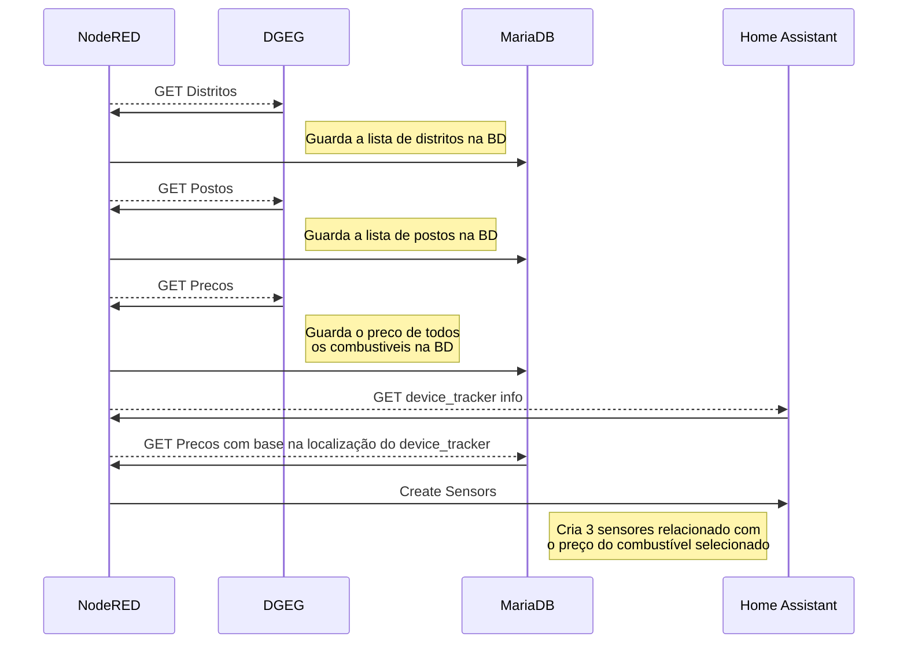

# HA-DGEG-Combustiveis
Node-RED flow que importa o preço dos combustiveis do site da DGEG para base de dados MariaDB, permitindo depois obter os preços mais baratos com base em coordenadas GPS, criando vários sensores no Home Assistant

## Como funciona?


## Requisitios:
- Home Assistant
- Addons:
	- NodeRED
	- MariaDB
- Custom Components:
	- Node-RED Companion Integration (HACS)

## Instalação
Todos os componentes têm de estar instalados e configurados.

**MariaDB**
Na configuração do Addon MariaDB é necessário adicionar uma nova base de dados e um login para a mesma.

> o nome da nova base de dados tem mesmo de ser `combustiveis`
> não esquecer de atribuir os `rights` para o login criado

Deverá ficar algo deste género
```
databases:
  - homeassistant
  - combustiveis
logins:
  - username: homeassistant
    password: my_really_long_password
  - username: nodered
    password: my_really_long_password
rights:
  - username: homeassistant
    database: homeassistant
  - username: nodered
    database: combustiveis
```

- Reiniciar o addon MariaDB
***
**NodeRED**
Importar o json que se encontra na pasta `nodered` [ha-dged-combustiveis.json](https://github.com/denkyem/HA-DGEG-Combustiveis/blob/main/nodered/ha-dged-combustiveis.json "ha-dged-combustiveis.json")
Este json irá criar um flow **`HA-Combustiveis`** e vários sub-flows de suporte


